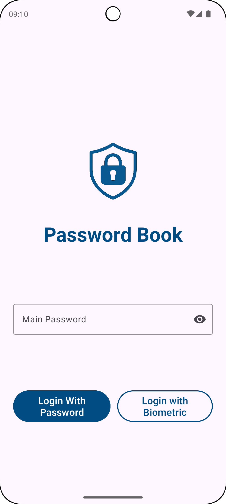
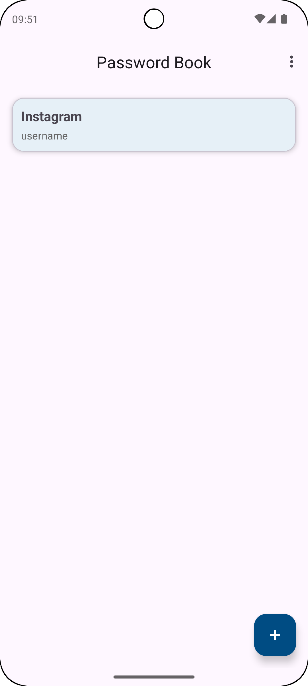
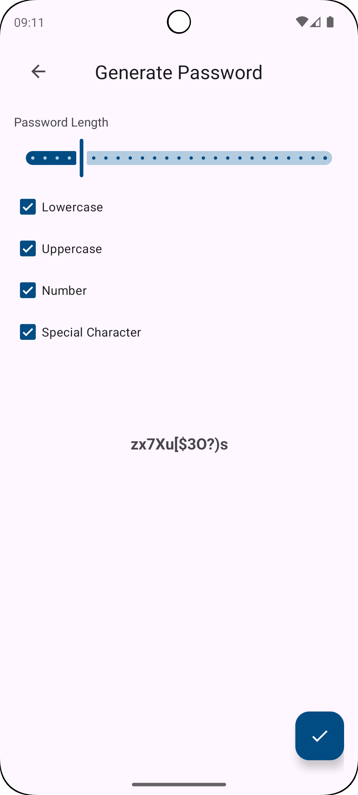
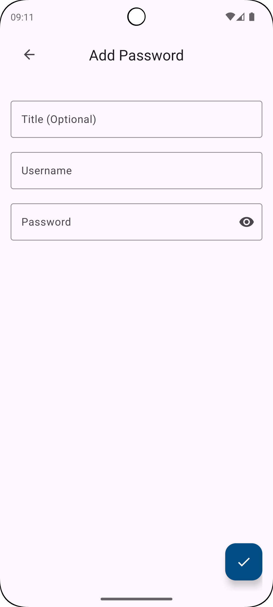
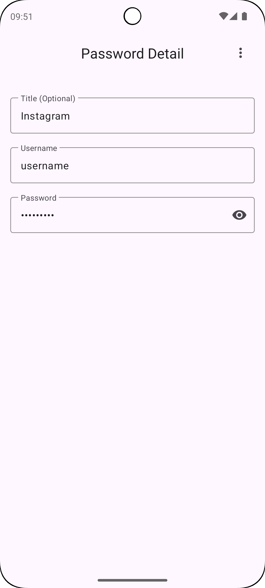

# 🔐 Password Book

Minimal, offline, and secure password manager built for Android – with modern Material Design, AES-256 encryption, biometric login, and customizable themes & language support.


---

## ✨ Features

- ✅ **AES-256** encrypted local storage (Room DB + Android Keystore)
- ✅ **Master password** protection + biometric authentication
- ✅ **Secure clipboard** (auto-clears in 30 seconds)
- ✅ **Password generator** (length, special characters, digits)
- ✅ **Offline only** – no network permission required
- ✅ **Export/Import encrypted** backups
- ✅ **Theme switcher** (Light / Dark / System)
- ✅ **Multi-language** support: English 🇬🇧, Turkish 🇹🇷
- ✅ **Root detection** for extra protection

---

## 📸 Screenshots

| Login | Home | Password Generator |
|-------|------|--------------------|
|  |  |  |
| Add | Detail |
|  |  |

---

## 🚀 Getting Started

### Requirements
- Android Studio Hedgehog or later
- Kotlin 1.9+
- Gradle 8.2+
- minSdk: 24  
- targetSdk: 34

### Clone the repo

```bash
git clone https://github.com/mahmutalperenunal/PasswordBook.git
